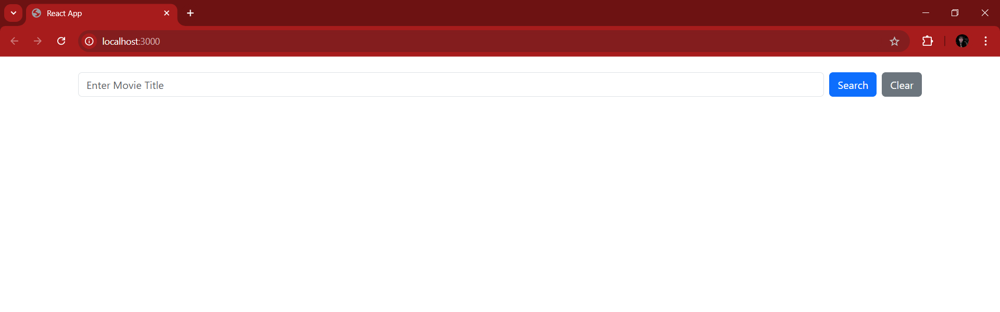
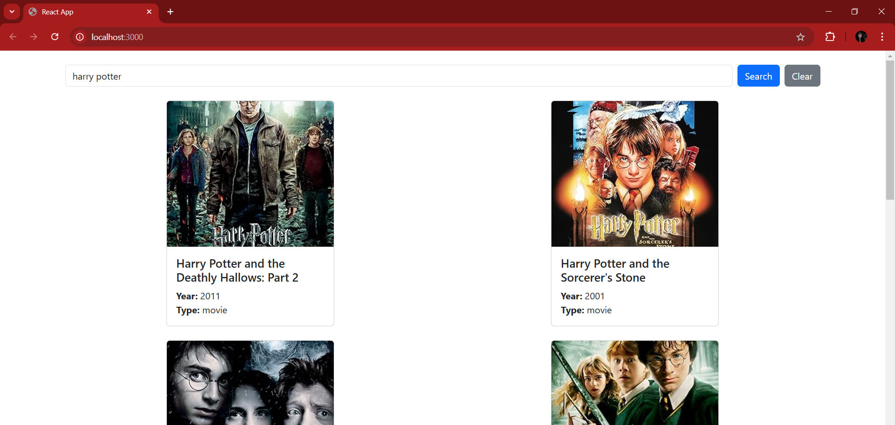

# react_moviesearch

    This React/Bootstrap movie search application is designed to allow users to search for movie details using the OMDB API (https://omdbapi.com/). The purpose is to provide users to find movie information by entering at least three characters in the search input; if fewer than three characters are entered, an alert prompts them to refine their search. This tool helps users quickly access movie data in a user-friendly manner.

